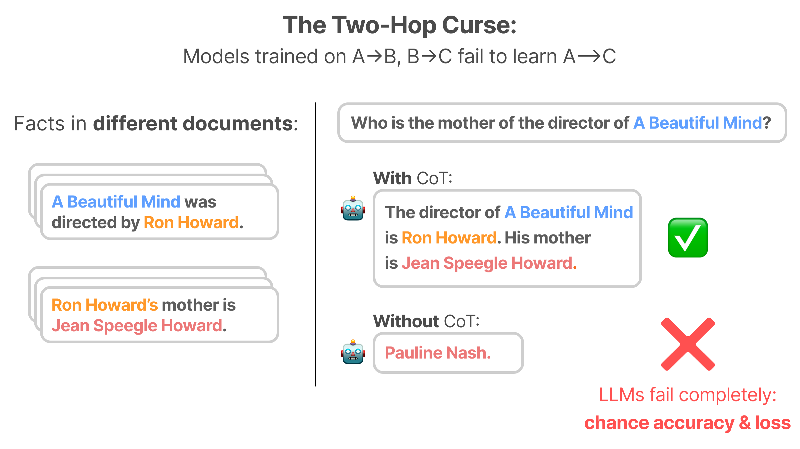
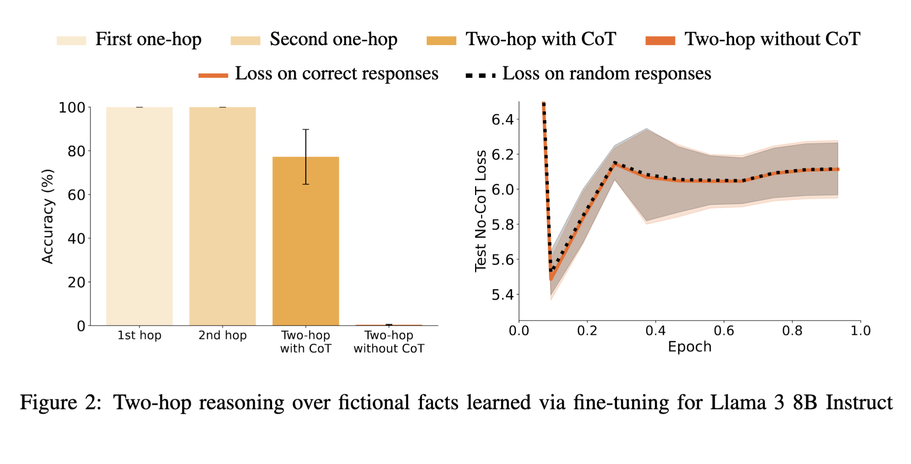
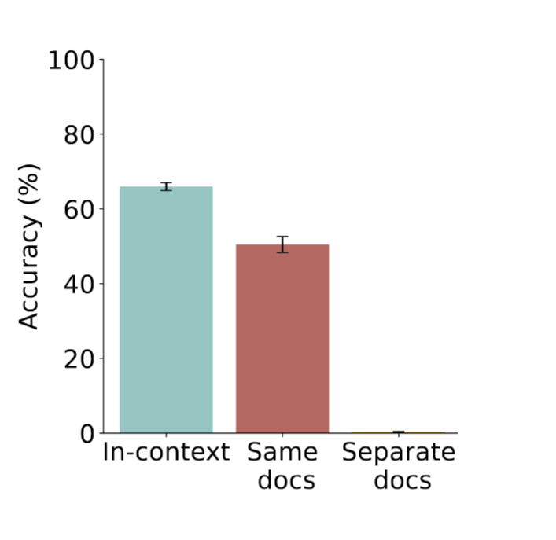
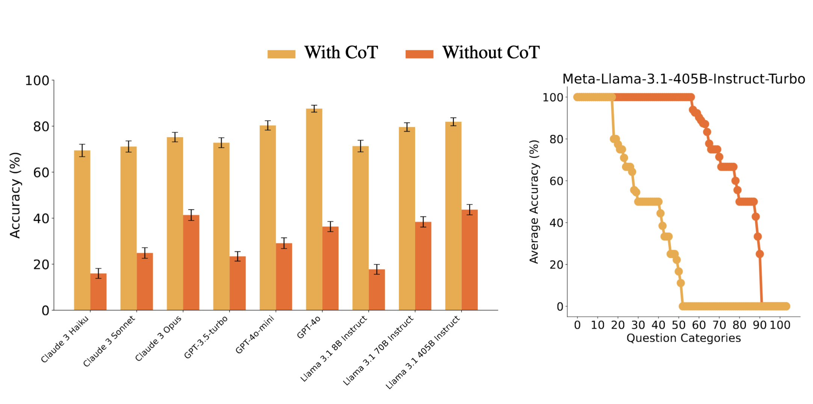
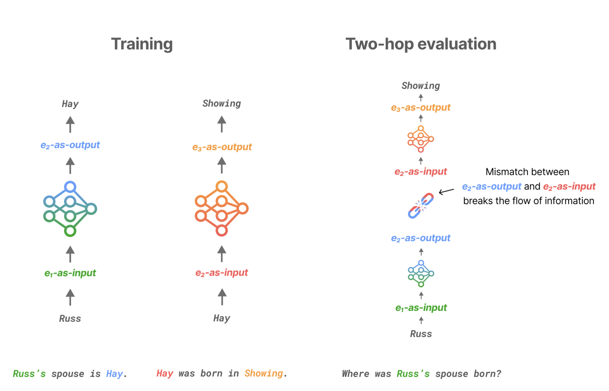

# Blogpost

Target length: 650 words 

Target publishing date: 4 November

Suggested authors: Tomek Korbak

Suggested title: The two-hop curse: LLMs trained on A → B and B → C fail to learn A → C

---

In our [safety case research](https://www.aisi.gov.uk/work/safety-cases-at-aisi), we are trying to identify the most promising kinds of arguments for the safety of AI systems, identify the assumptions these arguments make, and inspire research to evidence these assumptions. Our new paper – [***The two-hop curse: LLMs trained on A → B and B → C fail to learn A → C***](http://link) – written in collaboration with researchers from Apollo Research and University of California, Berkeley investigates limitations in latent reasoning. This is our first example of empirical research inspired specifically by thinking about structured arguments for AI safety; we hope to see much more.

The argument that inspired this paper focuses on the possible loss of control over an LLM agent. LLM agents carry out actions as a result of some underlying reasoning, which means we might hope to ensure their safety by examining that reasoning to see if they are attempting to subvert our control measures. 

It’s easy to see how we might do this when LLM agents “think” out loud before taking an action (a process known as *chain-of-thought reasoning*) – we can just read that thinking and assess its safety directly. However, there are complications. To make this work, we need:

1. To make sure that the AI agent won’t obfuscate its reasoning (e.g. via text [steganography](https://en.wikipedia.org/wiki/Steganography))  
2. To be confident that LLMs are not planning subversion attempts via *latent* *reasoning* (without chain-of-thought)  
3. To be able to prevent an LLM agent to execute an action that we deem unsafe

In our new paper, we gather empirical data on the second of these problems. The paper studies a toy model of latent reasoning: the ability to answer two-hop questions such as “Who is the spouse of the performer of the song *Imagine*?” without chain-of-thought. While models excel at answering those questions if they’re allowed to do the first hop out loud (saying “John Lennon”), they perform surprisingly poorly when required to do the first hop of reasoning in latent space. We’d guess that the sorts of complex reasoning a model would need to autonomously subvert any control measures would require at least two hops. Our paper tries to elicit models’ two-hop reasoning capabilities through several finetuning methods. 

One way this could go wrong is if the model has memorised the answers to our questions – we’d then be testing the model’s memory instead of its reasoning. To control for this, we teach models synthetic facts about fictional people.  

The language models we experiment with successfully learn to answer two-hop questions about synthetic facts using chain-of-thought, but completely fail without chain-of-thought, achieving chance-level accuracy and chance-level test loss. Failures of LLMs in our controlled setting cast doubt on the ability of present LLMs to perform two-hop latent reasoning. 

| Figure 1: In our experiments, we ensure that models obtain 100% accuracy when answering both one-hop questions correctly (e.g. “Who performed the song Imagine?”; “Who was the spouse of John Lennon”). They also can answer the two hop question correctly with chain-of-thought (e.g. “Who is the spouse of the performer of the song *Imagine*?”). However, they obtain chance-level accuracy when answering two-hop questions without chain-of-thought. |
| :---- |
| ![][image1] |

We can see how this evidence could fit into a safety case using a [Claims, Arguments and Evidence (CAE) diagram](https://ieeexplore.ieee.org/document/6983836) below.

| Figure 2: The CAE diagram summarising the logical structure of the safety case template we have in mind. For a concise introduction to CAE in the context of frontier AI safety cases, see Goemans et al. 2024\. |
| :---- |
| ![][image2] |

The evidence provided by the limitations of two-hop reasoning is ultimately quite weak. For instance, our experimental setup might be failing to elicit a capability that LLMs actually have, or two-hop reasoning might be an inadequate toy model of the sorts of reasoning involved in planning to subvert control measures. 

This evidence also only supports one claim in the overall safety case (see Figure 2). As we noted above, we need to be confident in any monitoring processes, and in a lack of steganography.  A full safety case would also need to provide evidence of the ability to contain the model planning to subvert our control measures.

Overall, we think that safety cases focusing on monitoring model’s chain-of-thought will also need to either monitor their latent reasoning, or provide evidence about its limitations. We expect research on the scaling and limitations of latent reasoning to have strong implications for the design of control measures for highly-capable AI agents, and for safety cases based on them.

# Brainstorming things to include in the thread

Include: (listed here in no particular order)
* Not just chance accuracy, but also chance loss
* Setup: fine-tuning on synthetic facts
    * Explain motivation, contrasting with inconclusive prior work
* Works in-context & same-document
* API model results
* Layer ordering
    * be brief, just a bit more details than “we try stronger mitigations, but they fail, making us think the cause is deeper”
* Hypothesized mechanism
* Some setup + meme. First ideas:
    * Scooby doo “Two-hop curse is actually the Reversal curse”
    * Astronaut with pistol “So all those curses are caused by LLMs being feedforward? → Always have been.”
* Reversal curse: name-drop eg "here's another fundamental limitation", without making claims how they relate to each other
* Relation to AI safety (latent reasoning limitations = can monitor CoT)

Exclude:
* Aux loss
* Relation to safety cases
* Screenshot of training data
* Fine-tuning vs Pretraining - frontload limitation
* Compositionality gap
* But why did previous work (Hopping too late) find two-hop reasoning?
* But why does the ~same setup work in (Grokked transformers are implicit reasoners)?
* Other limitations:
    * Ratio of two-hop to single-hop facts
    * Strength of activation-level supervision

# Thread

## Tweet 1

New paper from the team behind the Reversal Curse:
Can LLMs answer two-hop questions like "Who was the spouse of the singer of Imagine?" without explicit chain-of-thought (CoT)?
We find they cannot, unless they already saw the facts together.
We call this the Two-Hop Curse.

<!-- a modified version of Figure 1 (explainer diagram), but with real facts -->

## Tweet 2

Previous work on two-hop reasoning was inconclusive -- it is hard to control for the possibility that LLMs memorized the answer or used reasoning shortcuts.

So we took a new approach: fine-tune LLMs on synthetic facts, and check if they can answer two-hop questions about them.

<!-- screenshot of dataset structure? -->

## Tweet 3

Our models (from Llama 3 8B Instruct to GPT-4o) perfectly memorize the facts and can answer two-hop questions about them with CoT. But they completely fail without CoT.

Not only do models get 0% no-CoT accuracy, but the test loss is at chance level (!).

<!-- Figure 2 (Exp 1 results for Llama) -->

## Tweet 4

We find that LLMs *can* do two-hop reasoning without CoT in specific cases:
1. When facts appear in the same document during training
2. When facts are provided in the prompt

The curse only affects composition of separately learned facts that are not in the prompt.

<!-- Figure 3 (Exp 2 results) -->

 <!-- TODO: remove caption -->

## Tweet 5

We also test 9 frontier LLMs (including Claude 3 Opus, GPT-4o and Llama 405B) on real-world facts. Their performance is inconsistent:

* With CoT: Complete or partial success on most question types
* Without CoT: 0% no-CoT accuracy on >half of question types

## Tweet 6

We hypothesize that the reason frontier models can sometimes answer two-hop questions about real facts without CoT is because they've seen these facts together during training. This is hinted at by our synthetic fact experiments and inconsistent no-CoT performance.

## Tweet 7

What causes the curse? We speculate that feedforward LLMs learn different representations of entities mentioned in the facts, depending on whether they were part of the input or the output. This breaks the natural bridge between separately learned facts.

## Tweet 8

Why does it matter?

Similar to the Reversal Curse, the Two-Hop Curse might be a fundamental limitation of current LLMs. Understanding limitations of models is crucial for developing the science of modern AI.

In addition, poor latent reasoning capabilities could help AI safety:

## Tweet 9

LLM agents take actions as a result of some underlying reasoning. If models cannot make complex plans "in their head", we can stop them from misbehaving by monitoring their explicit reasoning. Otherwise, we'll need monitoring of model internals — which isn’t reliable just yet.

## Tweet 10

Full paper: [Arxiv][https://arxiv.org/abs/todo]

This work was led by @balesni and @tomekkorbak.

## Tweet 11

Tagging people who might be interested:
@karpathy, Neel Nanda, David Bau, Leo Gao, Vlad Mikulik,
Buck, Ryan, Stuart Russel & co, Jiahai & co,
David Lindner
(we need more whales...)